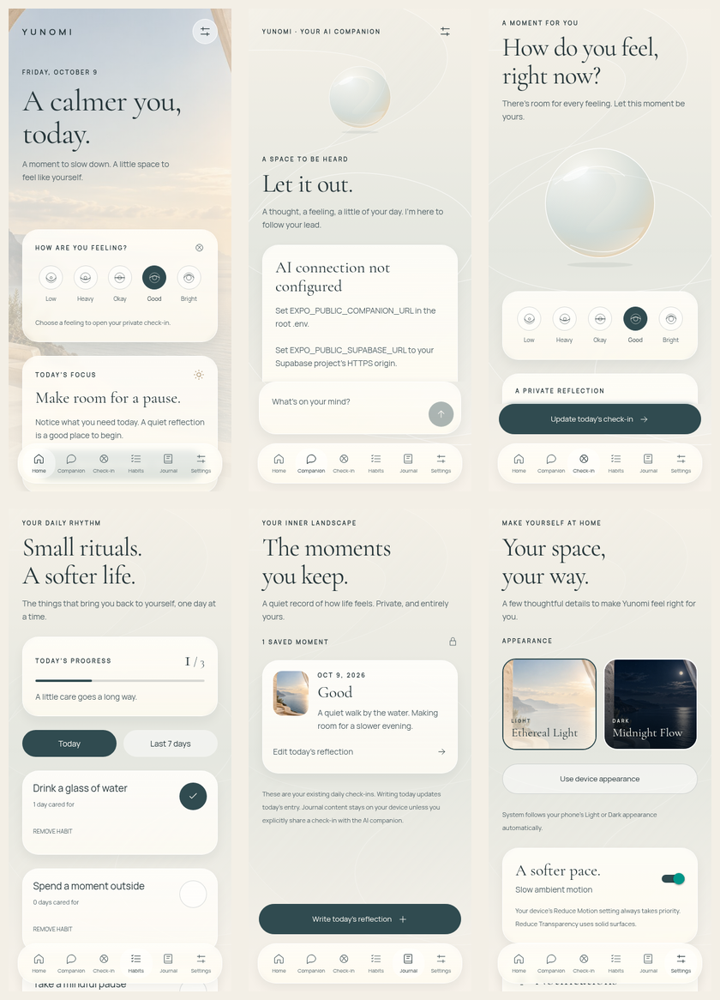
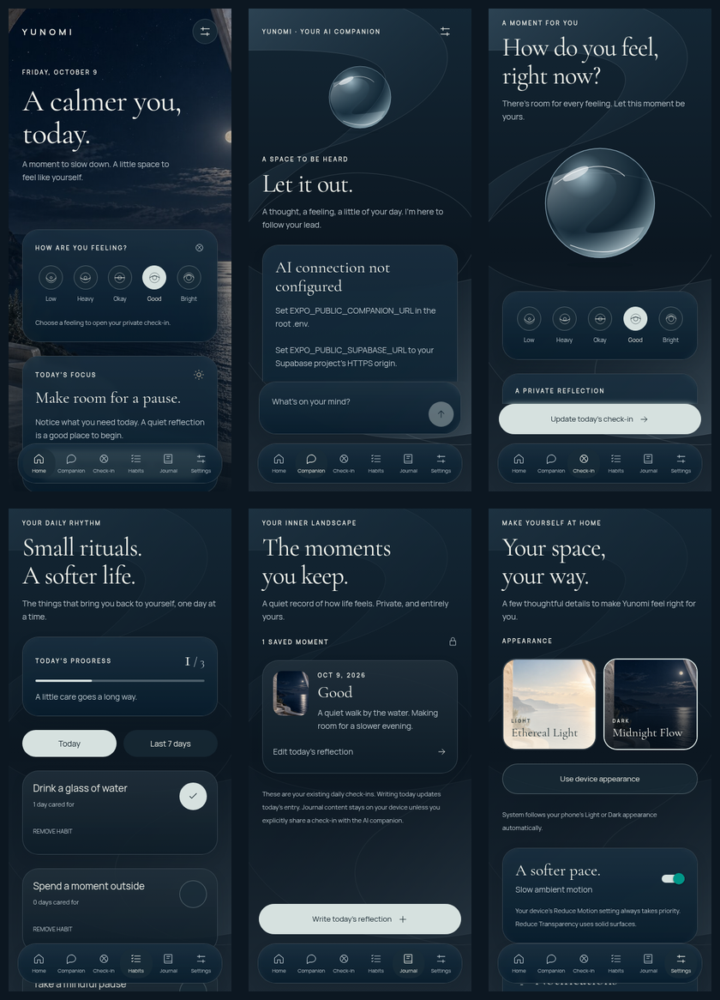

# Yunomi · Liquid Glass frontend review

This is an implemented Expo/React Native redesign of the existing app, on `codex/liquid-glass-redesign`. It is ready for visual review, not an automatic merge or a store-readiness claim.

**Reference limitation:** the request mentioned an attached design image, but no reference image was available in this conversation or workspace. This first pass follows the written brief. The screenshots below are rendered from the actual application; fidelity to the missing reference has not been established. Supply the reference before accepting a reference-match claim or final visual sign-off.

## Rendered previews

Rows: Home / Companion / Check-in, then Habits / Journal / Settings. Captured in Chromium at a 390 × 844 viewport, with America/New_York timezone and reduced motion. Only fictional reflection text entered through the real check-in UI appears in these screenshots. No AI replies, accounts, credentials or personal data were fabricated for display. The configuration warning in Chat is the actual state of the unconfigured cloud instance.

### Ethereal Light



### Midnight Flow



Individual full-size PNGs, weekly habit views, System light/dark, a 320px phone layout and a 768px tablet layout are in [previews](previews/).

## What changed

- Original day/night coastal architecture backgrounds, bundled locally and optimized to about 300 KB combined.
- Bundled OFL-licensed Cormorant Garamond editorial typography and Manrope body text. Font fallback is available if loading fails.
- Theme-aware glass surfaces, subtle borders/reflections, custom SVG icons, fluid SVG ribbon backgrounds, a translucent liquid orb, and a floating six-item navigation dock.
- Home mood options open Check-in with the tapped mood preselected; they do not silently save or share it. Today's focus and habit totals remain local.
- Chat keeps the existing provider/auth/request/state code. Only its presentation changes: floating keyboard-aware composer, clear message labels, per-turn errors and retries, consent, memory and privacy controls. The latest pending/replied turn scrolls into view. Safety support remains explicitly identified as non-AI support.
- Check-in preserves mood edits, note limits, save errors, recent entries, and explicit AI sharing. Its Save action floats above the dock.
- Habits retain add/remove/toggle/undo behavior. The weekly view reads the last seven days from existing completion dates; historical dates cannot be toggled from that view.
- Journal exposes existing daily reflections from `@yunomi/wellness/v1`, with understated thumbnails and ten-entry pages. Create/edit routes to the existing daily check-in model; it does not invent independent entries or migrate stored data. Older entries remain readable; today's entry is editable through Check-in.
- Settings offers Light, Dark and System with previews. Preferences and the optional ambient-motion choice persist under a separate `@yunomi/appearance/v1` key. Failed reads/writes surface an error rather than silently overwriting wellness data.
- Settings reuses the existing privacy/delete/memory/reset actions. Notifications were not implemented in the original app; the screen states that clearly and opens device settings without claiming to schedule reminders.

Backend, Supabase auth, service configuration/error handling, conversation logic, wellness models and the changes from PR #4 are preserved. The wellness provider's loading screen now consumes the theme; its business logic is unchanged.

## Motion and rendering choices

Ambient image/orb/ribbon movement uses native-driver opacity/transform-capable animation only, never layout animation. Loops stop for unfocused screens and while the app backgrounds. The OS Reduce Motion setting always overrides the app preference; disabling ambient motion also removes navigation fades and button scaling. iOS Reduce Transparency removes translucent/blurred materials.

Glass cards use Expo Blur on iOS/web. Android uses a deliberate layered translucent gradient/tint fallback, avoiding live Android capture overhead in Expo Go. Long repeating habit/journal rows disable live blur; journal pages limit mounted rows. Both backgrounds are 768 × 1152 JPEGs, about 7 MB combined when decoded; native caches may retain both. No continuous image downloading, GPU shader library, remote font fetch or cartoon assets are used.

## Validation performed here

- App TypeScript: passed.
- App automated tests: 31 passed, including appearance parsing/System resolution, calendar-week boundaries, solid-surface/button contrast and the existing wellness/conversation/auth tests.
- Backend automated tests: 11 passed; backend source was not modified.
- `expo install --check`: passed against SDK 57's local bundled dependency metadata in offline mode. This does not replace online Expo Doctor or device validation.
- Production exports: iOS and Android Hermes bundles and the web visual preview passed.
- Browser interaction checks: all six screens rendered in both themes with no page errors; actual mood save, habit toggle, journal reflection display, theme persistence after reload, System color-scheme changes, and small-phone/tablet layouts passed.
- Text/button palette pairs meet 4.5:1 contrast against solid surfaces. That test does not certify every photograph-backed pixel, device setting, or accessibility interaction.

## Run and review

```sh
git fetch origin
git checkout codex/liquid-glass-redesign
npm ci
npm run typecheck
npm test
npx expo install --check
npm start
```

Open with SDK 57-compatible Expo Go on iPhone/Android. Existing AI setup remains in [COMPANION_SETUP.md](COMPANION_SETUP.md). This redesign does not configure missing providers or prove a live AI conversation.

For a desktop **visual preview**:

```sh
npx expo start --web
```

Web dependencies/platform support were added for rendering and review. Web is not a supported authenticated companion deployment: SecureStore and the existing native-targeted backend/CORS setup are unchanged. Do not interpret the browser screenshots as real AI connectivity tests. No fake conversation mode is added.

## Required native review before merging

- Attach and compare the actual reference image; revise spacing, typography, imagery and material treatment if needed.
- Verify all six screens in Expo Go on an iPhone and Android device, with Light, Dark and System; terminate/relaunch and verify appearance persistence.
- Confirm iOS safe-area/dock position, Android back behavior, floating composer/save controls with the keyboard, multiline text, landscape/tablet layout where applicable, large Dynamic Type and VoiceOver/TalkBack.
- Check Reduce Motion on/off, Reduce Transparency on iOS, foreground/background transitions, tab switching and real-device frame rate/memory. Browser animation and native glass blur can differ.
- Recheck habit changes, saved journal/check-ins, consent, deletion, optional memory and retry against the configured real AI backend. Never label a stubbed test or offline safety response as a live AI reply.

No physical device, native simulator, real AI conversation, native blur/performance profile, or comparison to the absent reference image was verified in this environment. The PR is left unmerged for review.
